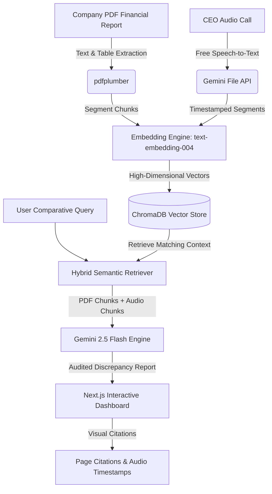

# 🎙️ Clarifin AI
> **Multimodal Financial Earnings Call Analyzer**
> 
> *Aligning corporate speech with written reality.*

---

## 📖 Overview
**Clarifin AI** is a state-of-the-art FinTech auditing system designed to cross-analyze written corporate filings (PDFs like 10-Q and 10-K reports) with spoken executive commentary (earnings call audio) to detect direct contradictions, numeric discrepancies, or corporate sentiment shifts. 

By leveraging **Retrieval-Augmented Generation (RAG)**, vector embeddings, and multi-modal processing, Clarifin gives analysts a transparent comparative workspace to verify verbal reassurances against legally binding disclosures.

---

## 🏗️ System Architecture & Data Flow



---

## 🧠 The ML & RAG Core: How It Works

### 1. The Vector Space (Semantic Embeddings)
Humans understand text through letters, but computers understand it through geometry. 
*   We use the **`text-embedding-004`** model to translate human sentences into **768-dimensional vectors** (arrays of floating-point numbers). 
*   In this high-dimensional vector space, sentences with similar meanings (e.g., *"revenue contracted"* and *"sales declined"*) are mapped close to each other.

### 2. The Retrieval Engine (ChromaDB)
*   **Vector Search**: When an analyst queries *"What did the CEO say about operating margins?"*, the query is converted into a vector.
*   **Cosine Similarity**: ChromaDB computes the mathematical distance (cosine similarity) between the query vector and the stored vectors of both the **PDF chunks** and the **Audio segments**.
*   **Filtering**: Using metadata tags, ChromaDB strictly filters search results to match only the specified `company` and `quarter`.

### 3. Augmentation & Generation (LLM Audit)
Unlike standard QA chatbots, Clarifin forces Gemini to run an **open-book examination**:
1. It retrieves the exact text blocks from the PDF filing (with page references).
2. It retrieves the exact text segments from the audio transcript (with speaker tags and timestamps).
3. It bundles them into a custom system prompt:
   ```text
   Compare the WRITTEN REPORT vs. the SPOKEN CALL. 
   Highlight contradictions. State exact pages and timestamps.
   ```
4. Gemini outputs a factual forensic report showing any mismatches.

---

## 🛠️ Technology Stack

| Component | Technology | Description |
| :--- | :--- | :--- |
| **Frontend** | **Next.js 16 (App Router)** | Premium, dark-themed responsive dashboard. |
| **Backend Web Server** | **FastAPI (Python)** | High-performance, async REST endpoints. |
| **Vector Database** | **ChromaDB** | Local, high-speed persistent vector database. |
| **LLM & Embeddings** | **Gemini 2.5 Flash** | Advanced reasoning, large context capacity, and embeddings. |
| **PDF Extraction** | **pdfplumber** | High-fidelity text and table parser. |
| **Audio Processing** | **Gemini Files API** | Free, native audio file transcription with timestamps. |

---

## 📁 Repository Structure

```text
Multimodal-Ml-project/
├── backend/
│   ├── .venv/               # Python Virtual Environment
│   ├── data/
│   │   ├── pdf/             # Corporate PDF filings (e.g. Apple/Q3-2024)
│   │   ├── audio/           # Raw earnings call audio (.wav/.mp3)
│   │   └── transcripts/     # Output timestamped transcripts (.json)
│   ├── chroma_db/           # Local persistent Vector DB files
│   ├── src/
│   │   ├── __init__.py
│   │   ├── ingestion.py     # Parses PDFs, chunks text, and indexes in ChromaDB
│   │   ├── analyzer.py      # Executes RAG comparative queries using Gemini
│   │   ├── transcribe.py    # Transcribes audio files via Gemini Files API
│   │   └── create_apple_pdf.py  # Utility to compile sample Apple PDF
│   ├── main.py              # FastAPI endpoints
│   ├── requirements.txt     # Python backend dependencies
│   ├── rag_experiment.ipynb # Step-by-step notebook playground
│   └── .env                 # API Credentials (GEMINI_API_KEY)
├── frontend/                # Next.js Application
│   ├── src/app/
│   │   ├── page.js          # Main Interactive Dashboard UI
│   │   ├── layout.js        # Global layout configuration
│   │   └── globals.css      # Core styles
│   └── package.json         # Node.js configurations
└── .gitignore               # Excludes virtual env, databases, and local files
```

---

## 🚀 Getting Started

### 📋 Prerequisites
*   Python 3.10+
*   Node.js 18+
*   A Gemini API Key (obtain from [Google AI Studio](https://aistudio.google.com/))

### 🔧 1. Backend Setup
1. Navigate to the backend folder:
   ```bash
   cd backend
   ```
2. Activate your Python virtual environment:
   ```bash
   source .venv/bin/activate
   ```
3. Create a `.env` file in the `backend/` directory:
   ```env
   GEMINI_API_KEY=your_gemini_api_key_here
   ```
4. Start the FastAPI development server:
   ```bash
   python main.py
   ```
   *The backend will boot up at **`http://localhost:8088`**.*

### 🌐 2. Frontend Setup
1. Open a new terminal tab and navigate to the frontend directory:
   ```bash
   cd frontend
   ```
2. Start the Next.js development server:
   ```bash
   npm run dev
   ```
   *The dashboard will launch at **`http://localhost:3008`**.*

---

## 📊 How to Run an Audit

1. Open **`http://localhost:3008`** in your browser.
2. Under **1. Target Parameters**, enter `Apple` and `Q3-2024`.
3. Under **2. Ingest Multi-Modal Sources**:
   *   Select **Written Filing (PDF)**: Choose `backend/data/pdf/Apple/Q3-2024/aapl-q324-10q.pdf`.
   *   Select **Or Transcript File**: Choose `backend/data/transcripts/Apple/Q3-2024/apple_q3_2024_transcript.json`.
4. Click **Ingest & Analyze Core**.
5. Switch to the **Comparative Query Panel**, type a financial query (e.g. *"Did the CEO sound confident about their debt?"*), and hit **Compare**!
# Estato-Ai
